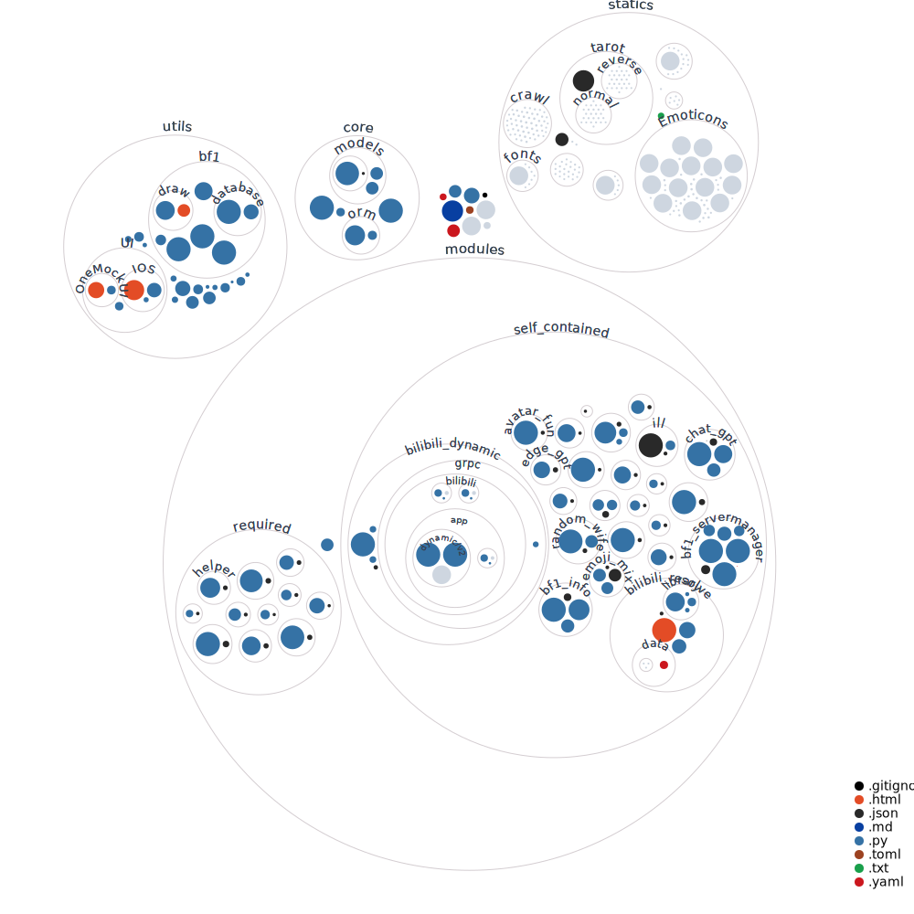

<div align="center">
 
<h1>xiaomai-bot</h1>

<div>一个以<a href="https://github.com/GraiaProject/Ariadne">Graia Ariadne</a>框架为基础的 QQ 机器人</div>
<br>
<div>若您在使用过程中发现了bug或有一些建议，欢迎提出ISSUE、PR或加入 <a href="https://jq.qq.com/?_wv=1027&k=1YEq9zks">QQ交流群：749094683</a> </div>
<br>
</div>

----
## 状态


## 功能简览:
### 注意！当前BOT还有许多不完善的地方，处于持续开发更新的状态~

- #### 目前主要维护的功能：
    - 战地一 战绩查询
    - 战地一 服务器管理
    - 其余功能请查看modules文件夹
    
- #### TODO:
    - 分群组的alias自定义指令前缀处理
    - ~~抄其他bot的功能~~
    
## 简易搭建:

1. python3.10+环境, Mirai:[MCL2.1.0](https://docs.mirai.mamoe.net/ConsoleTerminal.html) + 配置[MAH](https://docs.mirai.mamoe.net/mirai-api-http/)

2. 安装环境依赖(请用推荐方式安装[poetry](https://python-poetry.org/docs/#installation) )
   
   使用poetry的虚拟环境请直接在bot根目录终端执行:
   ``` 
   poetry install
   ```
   或者其他虚拟环境(关闭poetry的创建虚拟环境:```poetry config virtualenvs.create false```)
3. 打开config_demo.yaml文件填写配置信息,填写好后请改名为config.yaml再启动
4. 启动bot在bot根目录下使用poetry run python main.py
5. ~~根据报错缺啥弄啥吧(~~
## 使用环境变量初始化
| 变量名称            | 解释              | 示例                          |
|-----------------|-----------------|-----------------------------|
| bot_accounts    | bot所使用的账户使用,做分割 | 1111111111,222222222        |
| default_account | 默认bot账户         | 1111111111                  |
| Master          | bot管理者账户        | 3333333333                  |
| mirai_host      | mah服务器          | http://localhost:8080       |
| verify_key      | mah服务器验证token   | 123456789                   |
| test_group      | 发送调试信息的群组       | 5555555555                  |
| db_link         | sqlite3数据位置     | sqlite+aiosqlite:///data.db |
docker 及 docker-compose 请使用环境变量进行配置
## 使用Docker部署
请先安装docker
如使用环境变量控制sqlite3位置请同时修改部署文件或指令的映射路径
```bash
git clone https://github.com/g1331/xiaomai-bot                                                          # 下载项目
cd xiaomai-bot                                                                                          # 进入项目目录
docker build -t xiaomai-bot .                                                                           # 构建docker镜像
mv config_demo.yaml config.yaml                                                                         # 请修改配置文件
sqlite3 /xiaomai-bot/config/data.db                                                                     # 创建sqlite数据库
sqlite> .database                                                                                       # 查看数据库
sqlite> .quit                                                                                           # 退出sqlite
docker run -d --name xiaomai-bot\                                                                       # 容器名
      --net=host \                                                                                      # 使用主机网络
      -v /xiaomai-bot/config/config.yaml:/xiaomai-bot/config.yaml \                                     # 挂载配置文件
      -v /xiaomai-bot/config/data.db:/xiaomai-bot/data.db \                                             # 挂载数据库
      -v /xiaomai-bot/data/battlefield:/xiaomai-bot/data/battlefield/ \                                 # 挂载战地一机器人资源
      -v /xiaomai-bot/imgs/random_picture:/xiaomai-bot/modules/self_contained/random_picture/imgs/ \    # 挂载随机图片
      -v /xiaomai-bot/imgs/random_wife:xiaomai-bot/modules/self_contained/random_wife/imgs/ \           # 挂载随机老婆图片
      -v /xiaomai-bot/imgs/random_dragon:xiaomai-bot/modules/self_contained/random_dragon/imgs/ \       # 挂载随机龙图图片
#      -e bot_accounts=bot所使用的账户使用,做分割
#      -e default_account=默认bot账户
#      -e Master=bot管理者账户
#      -e mirai_host=mah服务器
#      -e verify_key=mah服务器验证token
#      -e test_group=发送调试信息的群组
#      -e db_link=sqlite3数据位置
      xiaomai-bot                                                                                       # 运行容器
```
## 使用docker-compose部署
请先安装docker与docker-compose
如使用环境变量控制sqlite3位置请同时修改部署文件或指令的映射路径

```bash
git clone https://github.com/g1331/xiaomai-bot                                                          # 下载项目
cd xiaomai-bot                                                                                          # 进入项目目录
sqlite3 /xiaomai-bot/config/data.db                                                                     # 创建sqlite数据库
sqlite> .database                                                                                       # 查看数据库
sqlite> .quit                                                                                           # 退出
mv config_demo.yaml config.yaml                                                                         # 请修改配置文件，以及docker-compose.yml中的挂载路径
docker-compose up -d                                                                                    # 构建并运行容器
```

---

# V3项目结构与核心内容


项目结构:
```

XiaoMaiBot

├─── core               核心-机器人配置/信息

│  ├─── orm             对象关系映射-进行数据库处理

│  │  ├─── __init__.py

│  │  └─── tables.py    内置表

│  ├─── models          辅助控制组件

│  │  └─── ...

│  ├─── bot.py          机器人核心代码-负责统一调度资源

│  ├─── config.py       机器人配置访问接口

│  ├─── control.py      控制组件-鉴权、开关前置、冷却

│  └─── ...

├─── data               存放数据文件

│  └─── ...

├─── resources          存放项目资源

│  └─── ...

├─── utils              存放运行工具

│  └─── ...

├─── log                机器人日志目录

│  ├─── xxxx-xx-xx

│  │  ├─── common.log   常规日志

│  │  └─── error.log    错误日志

│  └─── ...

├─── modules            机器人插件目录

│  ├─── required        必须插件

│  │  └─── ...

│  ├─── self_contained  内置插件

│  │  └─── ...

│  └─── ...

├─── config.yaml        机器人主配置文件

├─── main.py            应用执行入口

├─── pyproject.toml     项目依赖关系和打包信息

├─── poetry.lock        项目依赖

├─── README.md          项目说明文件

└─── ...  

```




## 核心(core):


### orm:
- [x] AsyncORM


### 配置:
bot基础配置:

- [x] bot_accounts:[]
- [x] default_account
- [x] master_qq
- [x] admins:[]
- [x] host_url
- [x] verify_key


### 控制组件（control）:

#### Permission 权限判断:
- [x] 成员权限判断
- [x] 群权限判断


#### Frequency频率限制:
- [x] current_weight/total_weight


#### Config配置判断:
- [x] require(需要的配置信息)


#### Distribute多账户消息分发:
- [x] 分发require
  
    多账户响应模式:
    - [x] 随机响应(默认)
    - [x] 指定bot响应(指定模式)


#### Function功能开关:
- [x] 开关判断->Function.require("模组名")

插件结构:

metadata.json:
```json
{
    "level": "插件等级1/2/3",
    "name": "文件名",
    "display_name": "显示名字",
    "version": "0.0.1",
    "authors": ["作者"],
    "description": "描述",
    "usage": ["用法"],
    "example": ["例子"],
    "default_switch": true,
    "default_notice": false
}
```

modules:

```python
modules = {
    "module_name": {
        "groups": {
            "group_id": {
                "switch": bool,
                "notice": bool
            }
        },
        "available": bool
    }
}
```


## 内置插件(modules.required):

### auto_upgrade(自动检测更新):
- [x] 自动检测Github仓库的更新
- [x] 手动指令执行git pull


### saya_manager(插件管理):
- [x] 插件列表
- [x] 已加载插件
- [x] 未加载插件
- [x] 加载插件
- [x] 卸载插件
- [x] 重载插件
- [x] 开启插件
- [x] 关闭插件


### perm_manager(权限管理):
管理/查询权限
- [x] 更改用户权限
- [x] 查询用户权限
- [x] 更改群权限
- [x] 查询群权限
- [x] 增删BOT管理


### response_manager(响应管理):
管理/查询多账户响应模式
- [x] 查询BOT列表
- [x] 查询指定群的BOT
- [x] 设定多账户响应模式 随机/指定bot
- [x] 设定指定响应bot


### helper(帮助菜单/功能管理):
生成帮助菜单，打开/关闭群功能
- [x] 帮助
- [x] 开启功能
- [x] 关闭功能


### status(运行状态):
- [x] 查询bot运行状态

---

## 鸣谢 & 相关项目
- [`mirai`](https://github.com/mamoe/mirai) & [`mirai-console`](https://github.com/mamoe/mirai-console): 一个在全平台下运行，提供 QQ Android 和 TIM PC 协议支持的高效率机器人框架


感谢 [`GraiaProject`](https://github.com/GraiaProject) 带来的这些项目:

- [`Broadcast Control`](https://github.com/GraiaProject/BroadcastControl): 高性能, 高可扩展性，设计简洁，基于 asyncio 的事件系统
- [`Ariadne`](https://github.com/GraiaProject/Ariadne): 一个设计精巧, 协议实现完备的, 基于 mirai-api-http v2 的即时聊天软件自动化框架
- [`Saya`](https://github.com/GraiaProject/Saya) 简洁的模块管理系统
- [`Scheduler`](https://github.com/GraiaProject/Scheduler): 简洁的基于 `asyncio` 的定时任务实现
- [`Application`](https://github.com/GraiaProject/Application): Ariadne 的前身，一个设计精巧, 协议实现完备的, 基于 mirai-api-http 的即时聊天软件自动化框架

本BOT在开发中参考了如下项目:
- [`SAGIRI BOT`](https://github.com/SAGIRI-kawaii/sagiri-bot): 一个基于 Mirai 和 [Graia-Ariadne](https://github.com/GraiaProject/Ariadne) 的QQ机器人
- [`ABot`](https://github.com/djkcyl/ABot-Graia/): 一个使用 [Graia-Ariadne](https://github.com/GraiaProject/Ariadne) 搭建的 QQ 功能性~~究极缝合怪~~机器人
- [`redbot`](https://github.com/Redlnn/redbot): 一个以 [Graia Ariadne](https://github.com/GraiaProject/Ariadne) 框架为基础的 QQ 机器人

## Stargazers over time

[](https://starchart.cc/g1331/xiaomai-bot)