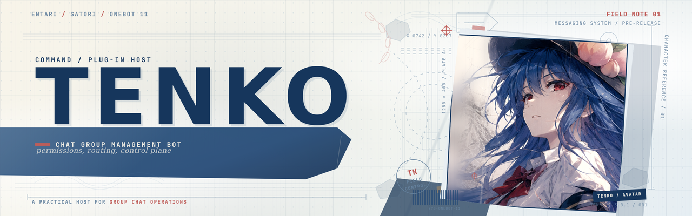
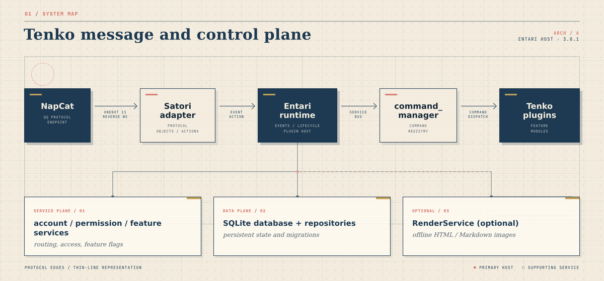

<p align="center">
  
</p>

<p align="center">
  
  
  
  
</p>

Tenko 是一个面向 QQ 群的管理 bot，基于 Entari 与 Satori 协议抽象构建，通过
OneBot 11 协议接入 QQ；协议端推荐使用 NapCat，也可替换为任何兼容 OneBot 11 /
Satori 的实现。它提供权限、群管理、账号响应策略、功能开关、状态查询和宿主升级
等能力。

<p align="center">
  
</p>

## 功能概览

Tenko 的命令统一使用 / 前缀。下面的命令名称与 tenko/plugins/ 中当前注册的
插件保持一致；尖括号表示需要替换的参数。

| 插件 | 能力 | 常用命令 |
| --- | --- | --- |
| perm_manager | 管理成员权限、群权限，并同步群成员的平台管理角色 | /修改权限、/修改群权限、/权限列表 |
| helper | 从当前 command_manager 注册表生成帮助列表和命令详情 | /帮助、/帮助 <编号> |
| group_manager | 查询群设置、审批加群请求，以及执行禁言、解禁、撤回、加精和踢出等群管理动作 | /群设置、/同意邀请 <请求ID>、/禁言、/解禁 |
| status | 查看会话、进程资源、消息收发统计、在线账号和群路由状态 | /状态 |
| exception_catcher | 捕获全局异常，向超级用户发送带会话上下文的报告，必要时保存本地证据 | 无命令 |
| response_manager | 查询多账号在线状态、群绑定、禁言状态，并设置群响应策略 | /BOT列表、/在线BOT、/设定响应 |
| announcement | 向已开启指定功能的群推送公告，并返回逐群结果 | /公告 <功能名> <内容...> |
| updater | 按配置通道检查、准备和回滚 Tenko 宿主版本 | /检查更新、/升级、/回滚 |
| feature_manager | 按群启用或停用插件功能 | /开启 <插件编号或名称>、/关闭 <插件编号或名称> |
| render | 提供 HTML 和 Markdown 的离线图片渲染服务，供状态和异常报告使用 | 无命令 |

涉及权限变更、群管理或宿主升级的命令会按照当前群权限、账号能力和超级用户
配置执行。渲染不可用时，状态和异常报告使用文本路径。

## 架构



<details>
<summary>文本版架构图</summary>

```text
OneBot 11 endpoint (e.g. NapCat)
  │
  ▼
Satori adapter ──► Entari runtime ──► command_manager ──► Tenko plugins
                                      │
                                      ├── account / permission / feature services
                                      ├── SQLite database + repositories
                                      └── RenderService (optional)
```

</details>

兼容 OneBot 11 的协议端（以下以 NapCat 为例）通过反向 WebSocket 连接 Tenko，
Satori 负责协议对象和动作抽象，Entari 负责事件分发、插件生命周期和命令处理：

- 插件在 Entari 生命周期中加载和卸载；插件通过原生命令注册表接收命令，
  通过宿主服务访问账号路由、权限、功能开关、限流和升级控制平面。
- command_manager 是帮助系统读取命令列表的来源，因此帮助内容会随当前已注册
  插件变化。
- RenderService 由 tenko/plugins/render 注册为 Entari 服务，使用 Playwright 在本地
  离线渲染 HTML/Markdown。渲染默认关闭，可通过 [render].enabled 开启；服务异常
  不会阻断文本功能。
- 数据层使用 SQLite、SQLAlchemy 和 entari-plugin-database。新 ORM 位于
  tenko/db/models.py，repository 位于 tenko/db/repositories.py；应用启动时会创建
  或迁移所需表，已有 SQLite 数据库文件可以继续使用。

## 安装与运行

### 环境要求

- Python >=3.10,<3.13；
- 可连接到 OneBot 11 端点的协议端（例如 NapCat）及网络环境；
- 启用图片渲染时，需要 Chromium 浏览器运行时。

### 创建独立环境

推荐使用 uv 管理依赖（基于 pyproject.toml 与 uv.lock）：

    uv sync

uv 会在项目根目录创建 .venv 并按锁文件安装依赖，之后通过 uv run 执行命令：

    uv run python -m tenko
    uv run pytest -q

如果不想使用 uv，也可以手动创建虚拟环境并按 requirements-entari.txt 安装：

    python -m venv .venv-entari
    source .venv-entari/bin/activate
    pip install -r requirements-entari.txt

Windows PowerShell 的激活命令为：

    .venv-entari\Scripts\Activate.ps1

复制配置模板：

    cp config/tenko.toml.example config/tenko.toml

然后按下节说明编辑 config/tenko.toml。启动：

    python -m tenko      # 或 uv run python -m tenko

### 协议端连接（以 NapCat 为例）

默认反向 WebSocket 地址为：

    ws://127.0.0.1:8080/onebot/v11/ws

在所选 OneBot 11 协议端的反向 WebSocket 配置中填写相同地址。下面以 NapCat
为例，在 NapCat 的 OneBot 11 反向 WebSocket 配置中填写相同地址。若配置了
[onebot].access_token，该协议端必须使用相同的 token；示例文件和下方最小配置
只使用占位符，部署时请替换为实际值。

### 启用图片渲染

保持 [render].enabled = false 时无需安装浏览器。需要状态图片或异常图片时，
在当前虚拟环境中执行（uv 环境可写为 uv run python -m playwright ...）：

    python -m playwright install chromium

Linux 主机缺少 Chromium 系统依赖时，需要由运维按主机权限安装对应依赖。

## 最小配置

config/tenko.toml 可以从示例复制后按需补充。下面的配置覆盖连接、权限、
数据库、渲染和升级的基本入口；所有敏感字段和账号标识都是占位符：

    [onebot]
    listen_host = "127.0.0.1"
    listen_port = 8080
    reverse_ws_prefix = "/"
    reverse_ws_path = "onebot/v11"
    reverse_ws_endpoint = "ws"
    access_token = "<ONEBOT_ACCESS_TOKEN>"
    api_timeout = 60
    satori_host = "127.0.0.1"
    satori_path = "satori"
    satori_token = "<SATORI_TOKEN>"

    [runtime]
    send_replies = false
    reply_text = "Tenko 已收到消息。"
    log_level = "INFO"
    command_prefix = "/"

    [entari]
    superusers = { onebot = ["<QQ_ID>"] }

    [debug]
    enabled = false

    [database]
    url = "sqlite+aiosqlite:///./.tenko/tenko.db"
    echo = false
    create_table_at = "preparing"

    [render]
    enabled = false
    timeout = 10.0
    width = 800
    quality = 85

    [upgrade]
    enabled = true
    source = "git_tag"
    repository = "."
    channel = "stable"
    policy = "check"

不要把真实 token、QQ 号、GitHub 凭据或其他密钥写入版本库。需要保护的测试群
可以在 TOML 顶层设置 test_group；留空或省略表示不启用该保护。

## 配置参考

配置读取自 tenko/config.py。未写出的配置项使用代码中的默认值；配置表中的
路径相对于启动目录解析。

### [onebot]

| 字段 | 说明 |
| --- | --- |
| listen_host | 反向 WebSocket 监听地址，默认 127.0.0.1 |
| listen_port | 监听端口，默认 8080 |
| reverse_ws_prefix | 反向 WebSocket 路径前缀，默认 / |
| reverse_ws_path | OneBot 11 路径，默认 onebot/v11 |
| reverse_ws_endpoint | WebSocket 端点名，默认 ws |
| access_token | 可选的 OneBot 访问 token；不设置时可留空 |
| api_timeout | OneBot action 超时时间，默认 60 秒 |
| satori_host | 内部 Satori 服务地址；省略时根据监听地址推导 |
| satori_path | 内部 Satori 路径，默认 satori |
| satori_token | 内部 Satori token，可留空关闭鉴权 |
| capability_overrides | 按账号覆盖平台能力学习结果的映射，值为布尔开关 |

### [runtime]、[entari] 与 [debug]

| 配置 | 说明 |
| --- | --- |
| runtime.send_replies | 是否对收到的消息发送固定回复，默认关闭 |
| runtime.reply_text | 固定回复文本，默认是 Tenko 已收到消息。 |
| runtime.log_level | 日志级别，默认 INFO |
| runtime.command_prefix | 命令前缀；Tenko 的对外命令约定固定为 / |
| runtime.superusers | 平台到用户 ID 的兼容输入；实际生效名单统一来自 entari.superusers |
| entari.superusers | 超级用户唯一权威来源，格式为“平台名到用户 ID 列表”的映射 |
| debug.enabled | 是否只处理 debug.masters 中用户产生的事件，默认关闭 |
| debug.masters | 调试白名单；省略时继承 entari.superusers，显式空列表表示不放行用户 |

例如，OneBot 11 的超级用户配置为：

    [entari]
    superusers = { onebot = ["<QQ_ID>"] }

### [database]、[accounts]、[features] 与 [exception]

| 配置 | 说明 |
| --- | --- |
| database.url | SQLAlchemy 数据库 URL，默认 sqlite+aiosqlite:///./.tenko/tenko.db |
| database.echo | 是否输出 SQL，默认关闭 |
| database.create_table_at | 建表时机，可选 preparing、prepared 或 blocking |
| accounts.state_path | 多账号路由状态文件，默认 .tenko/accounts.json |
| features.state_path | 群功能开关状态文件，默认 .tenko/features.json |
| features.default_enabled | 新群或未记录功能的默认开关，默认开启 |
| exception.message_buffer_size | 异常报告保留的最近消息数量，默认 10 |
| exception.evidence_dir | 报告无法投递时的本地证据目录，默认 .tenko/exceptions |

### [ratelimit]

| 字段 | 说明 |
| --- | --- |
| enabled | 是否启用命令限流，默认开启 |
| state_path | 限流状态文件，默认 .tenko/ratelimit.json |
| window_seconds | 滚动窗口长度，默认 15.0 秒 |
| max_weight | 窗口允许的最大权重，默认 24 |
| default_weight | 未单独指定命令的默认权重，默认 1 |
| cooldown_seconds | 同一来源冷却时间，默认 5.0 秒 |
| blacklist_seconds | 触发限制后的黑名单时间，默认 300.0 秒 |
| override_permission | 可豁免限流的最低权限等级，默认 32 |

### [render]

| 字段 | 说明 |
| --- | --- |
| enabled | 是否启用 Playwright 离线渲染，默认关闭 |
| timeout | 单次渲染超时时间，默认 10.0 秒 |
| width | 图片 viewport 宽度，默认 800 |
| quality | JPEG 质量，范围为 0 到 100，默认 85 |

### [upgrade]

升级配置控制版本发现、制品准备和外部重启接管。默认策略只检查，不会自动下载
或安装。

| 字段 | 说明 |
| --- | --- |
| enabled | 是否启用升级功能，默认开启 |
| source | 版本源：git_tag、github_release 或 manifest |
| repository | Git 版本源的仓库路径，默认当前目录 . |
| github_repository | GitHub 版本源的仓库标识 |
| manifest_url | manifest 版本源的地址 |
| github_token | 可选的 GitHub 访问 token |
| asset_name | 可选的发布制品名称 |
| tag_prefix | Git tag 前缀，默认 v |
| channel | 更新通道；stable 排除预发布版本，prerelease 同时接受正式和预发布版本 |
| policy | 执行策略；常用值为 check、download、install |
| current_version | 当前版本；留空时从项目版本读取 |
| config_version | 配置兼容版本，默认 1.0.0 |
| install_root | 版本和升级状态目录，默认 .tenko/upgrades |
| config_path | 外部配置路径，默认 config/tenko.toml |
| data_dir | 外部数据目录，默认 data |
| health_command | 可选健康检查命令参数列表 |
| launch_command | 可选外部启动命令参数列表 |
| health_timeout | 健康检查超时时间，默认 30 秒 |
| check_interval_hours | 定时检查间隔，默认 24 小时 |
| superuser_ids | 可执行升级命令的用户 ID；省略时继承 entari.superusers |

通道选择建议：

- stable 只选择正式版本，适合生产实例；
- prerelease 允许选择预发布版本，适合验证实例；
- policy = "check" 只发现并记录候选版本；
- policy = "download" 自动准备制品；
- policy = "install" 生成外部安装接管记录。进程切换仍由稳定的外部启动器完成。

## 更新机制

升级命令只允许配置的超级用户执行：

    /检查更新
    /升级
    /回滚

- /检查更新 查询配置通道中的候选版本，返回当前版本、候选版本和来源，
  不下载制品。
- /升级 获取并校验候选制品，完成兼容性和健康检查后生成外部安装接管记录；
  它不会在当前进程中热替换代码。
- /回滚 请求回到上一可用版本；不存在可回滚版本时会返回明确失败。

启用周期检查时，check_interval_hours 控制定时检查间隔。升级目录、配置目录和
数据目录彼此分离，升级过程不会覆盖用户配置或运行数据。

## 测试

在项目根目录、并使用已安装依赖的环境执行：

    ./.venv-entari/bin/ruff check tenko tests/tenko
    ./.venv-entari/bin/python -m pytest tests/tenko

使用 uv 环境时可以直接执行：

    uv run ruff check tenko tests/tenko
    uv run pytest -q

如果使用已激活的虚拟环境，也可以执行：

    ruff check tenko tests/tenko
    python -m pytest tests/tenko
