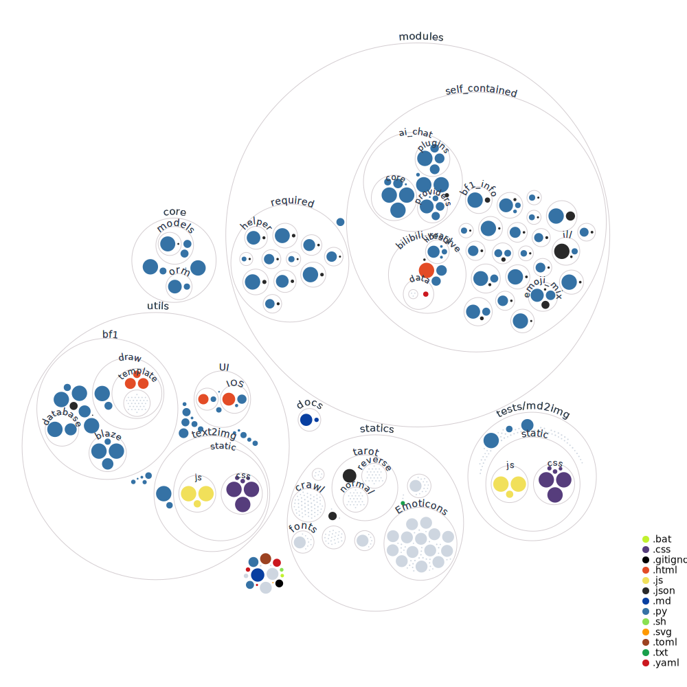

<div align="center">

<pre align="center">
 ___  ___  _____ ______   ________  ________  ___  ___          ________  ________  _________   
|\  \|\  \|\   _ \  _   \|\   __  \|\   __  \|\  \|\  \        |\   __  \|\   __  \|\___   ___\ 
\ \  \\\  \ \  \\\__\ \  \ \  \|\  \ \  \|\  \ \  \\\  \       \ \  \|\ /\ \  \|\  \|___ \  \_| 
 \ \  \\\  \ \  \\|__| \  \ \   __  \ \   _  _\ \  \\\  \       \ \   __  \ \  \\\  \   \ \  \  
  \ \  \\\  \ \  \    \ \  \ \  \ \  \ \  \\  \\ \  \\\  \       \ \  \|\  \ \  \\\  \   \ \  \ 
   \ \_______\ \__\    \ \__\ \__\ \__\ \__\\ _\\ \_______\       \ \_______\ \_______\   \ \__\
    \|_______|\|__|     \|__|\|__|\|__|\|__|\|__|\|_______|        \|_______|\|_______|    \|__|
</pre>


一个基于 [Graia Ariadne](https://github.com/GraiaProject/Ariadne) 框架的 QQ 机器人

<br>

若您在使用过程中发现了 bug
或有建议，欢迎提出 [Issue](https://github.com/g1331/xiaomai-bot/issues)、[PR](https://github.com/g1331/xiaomai-bot/pulls)
或加入 QQ 群聊：[749094683](https://jq.qq.com/?_wv=1027&k=1YEq9zks)

</div>

---

## 📊 状态


## ✨ 功能简览

> **注意！** 当前 BOT 还有许多不完善之处，处于持续开发更新状态中~

### 🔧 主要功能

- **战地一 战绩查询**
- **战地一 服务器管理**
- 其他功能请查看 `modules` 文件夹

### 🛠️ 待办事项

- 分群组的 alias 自定义指令前缀处理
- ~~抄其他 bot 的功能~~

## 🚀 快速搭建步骤

> _快速启动：Windows 使用 `run.bat`，Linux 使用 `run.sh`_

### 1. 安装 Mirai

- 下载 [MCL 2.1.0](https://docs.mirai.mamoe.net/ConsoleTerminal.html)
- 配置 [Mirai API HTTP (MAH)](https://docs.mirai.mamoe.net/mirai-api-http/)

### 2. 设置 Python 环境

本项目需要 `Python` 3.10 至 3.11 版本。推荐使用 `uv` 作为 Python 的依赖包管理工具，并通过 `uv` 创建虚拟环境，安装依赖包。

#### 2.1 安装 `uv`

- **Windows 用户**：

  ```powershell
  powershell -ExecutionPolicy ByPass -c "irm https://astral.sh/uv/install.ps1 | iex"
  ```

- **Linux 用户**：

  ```bash
  curl -LsSf https://astral.sh/uv/install.sh | sh
  ```

- **验证安装**：

  ```bash
  uv help
  ```

#### 2.2 安装 `Python`

如果尚未安装 `Python`，可通过 `uv` 安装：

- **列出可用的 Python 版本**：

  ```bash
  uv python list
  ```

- **安装指定版本**（例如 3.11.10）：

  ```bash
  uv python install 3.11.10
  ```

- **查找系统中已安装的 Python 路径**：

  ```bash
  uv python find
  ```

#### 2.3 创建虚拟环境

使用指定版本的 `Python` 创建虚拟环境：

```bash
uv venv --python 3.11
```

#### 2.4 安装依赖

从 `pyproject.toml` 安装依赖：

```bash
uv sync
```

#### 2.5 运行项目

```bash
uv run main.py
```

### 3. 配置文件

- 打开 `config_demo.yaml` 文件填写配置信息
- 填写完成后重命名为 `config.yaml`

### 4. 启动 Bot

在 Bot 根目录下运行：

```bash
uv run main.py
```

### 5. 处理报错

根据报错信息进行相应处理。

## 🔐 使用环境变量初始化

| 变量名称              | 解释              | 示例                            |
|-------------------|-----------------|-------------------------------|
| `bot_accounts`    | Bot 使用的账户，逗号分隔  | `1111111111,222222222`        |
| `default_account` | 默认 Bot 账户       | `1111111111`                  |
| `Master`          | Bot 管理者账户       | `3333333333`                  |
| `mirai_host`      | MAH 服务器地址       | `http://localhost:8080`       |
| `verify_key`      | MAH 服务器验证 token | `123456789`                   |
| `test_group`      | 发送调试信息的群组       | `5555555555`                  |
| `db_link`         | SQLite3 数据库位置   | `sqlite+aiosqlite:///data.db` |

> Docker 及 Docker Compose 部署请使用环境变量进行配置。

## 🐳 使用 Docker 部署

1. **安装 Docker**

2. **克隆项目并构建镜像**

   ```bash
   git clone https://github.com/g1331/xiaomai-bot
   cd xiaomai-bot
   docker build -t xiaomai-bot .
   ```

3. **配置文件**

   ```bash
   mv config_demo.yaml config.yaml
   sqlite3 /xiaomai-bot/config/data.db
   sqlite> .database
   sqlite> .quit
   ```

4. **运行容器**

   ```bash
   docker run -d --name xiaomai-bot \
     --net=host \
     -v /xiaomai-bot/config/config.yaml:/xiaomai-bot/config.yaml \
     -v /xiaomai-bot/config/data.db:/xiaomai-bot/data.db \
     -v /xiaomai-bot/data/battlefield:/xiaomai-bot/data/battlefield/ \
     -v /xiaomai-bot/imgs/random_picture:/xiaomai-bot/modules/self_contained/random_picture/imgs/ \
     -v /xiaomai-bot/imgs/random_wife:/xiaomai-bot/modules/self_contained/random_wife/imgs/ \
     -v /xiaomai-bot/imgs/random_dragon:/xiaomai-bot/modules/self_contained/random_dragon/imgs/ \
     xiaomai-bot
   ```

   > **提示**：根据需要添加环境变量，例如：
   >
   > `-e bot_accounts=1111111111,222222222`
   >
   > `-e default_account=1111111111`
   >
   > `-e Master=3333333333`
   >
   > `-e mirai_host=http://localhost:8080`
   >
   > `-e verify_key=123456789`
   >
   > `-e test_group=5555555555`
   >
   > `-e db_link=sqlite+aiosqlite:///data.db`

## 🐳 使用 Docker Compose 部署

1. **安装 Docker 与 Docker Compose**

2. **克隆项目并设置数据库**

   ```bash
   git clone https://github.com/g1331/xiaomai-bot
   cd xiaomai-bot
   sqlite3 /xiaomai-bot/config/data.db
   sqlite> .database
   sqlite> .quit
   mv config_demo.yaml config.yaml
   ```

3. **启动服务**

   ```bash
   docker-compose up -d
   ```

---

## 📂 项目结构与核心内容

### 项目结构

```
xiaomai-bot/
├── core/                   # 核心 - 机器人配置与信息
│   ├── orm/                # 对象关系映射 - 数据库处理
│   │   ├── __init__.py
│   │   └── tables.py       # 内置表
│   ├── models/             # 辅助控制组件
│   │   └── ...
│   ├── bot.py              # 机器人核心代码 - 统一调度资源
│   ├── config.py           # 机器人配置访问接口
│   ├── control.py          # 控制组件 - 鉴权、开关前置、冷却
│   └── ...
├── data/                   # 存放数据文件
│   └── ...
├── resources/              # 存放项目资源
│   └── ...
├── utils/                  # 存放运行工具
│   └── ...
├── log/                    # 机器人日志目录
│   ├── xxxx-xx-xx/
│   │   ├── common.log      # 常规日志
│   │   └── error.log       # 错误日志
│   └── ...
├── modules/                # 机器人插件目录
│   ├── required/           # 必须插件
│   │   └── ...
│   ├── self_contained/     # 内置插件
│   │   └── ...
│   └── ...
├── config.yaml             # 机器人主配置文件
├── main.py                 # 应用执行入口
├── pyproject.toml          # 项目依赖关系和打包信息
├── uv.lock                 # 依赖锁文件
├── README.md               # 项目说明文件
└── ...
```



### 核心模块

#### 🗄️ ORM

- **AsyncORM**：异步对象关系映射工具

#### ⚙️ 配置

Bot 基础配置：

- `bot_accounts`: []
- `default_account`: 默认账户
- `master_qq`: 管理者 QQ
- `admins`: []
- `host_url`: 服务器地址
- `verify_key`: 验证 Token

#### 🔒 控制组件（Control）

##### 权限判断（Permission）

- 成员权限判断
- 群权限判断

##### 频率限制（Frequency）

- 当前权重 / 总权重

##### 配置判断（Config）

- 需要的配置信息

##### 消息分发（Distribute）

- 分发需求
- 多账户响应模式：
    - 随机响应（默认）
    - 指定 Bot 响应

##### 功能开关（Function）

- 开关判断：`Function.require("模块名")`

### 🔌 插件结构

#### `metadata.json`

```json
{
  "level": "插件等级1/2/3",
  "name": "文件名",
  "display_name": "显示名字",
  "version": "0.0.1",
  "authors": [
    "作者"
  ],
  "description": "描述",
  "usage": [
    "用法"
  ],
  "example": [
    "例子"
  ],
  "default_switch": true,
  "default_notice": false
}
```

#### `modules` 配置

```python
modules = {
    "module_name": {
        "groups": {
            "group_id": {
                "switch": bool,
                "notice": bool
            }
        },
        "available": bool
    }
}
```

### 🛠️ 内置插件 (`modules.required`)

#### 🔄 auto_upgrade（自动检测更新）

- 自动检测 GitHub 仓库更新
- 手动指令执行 `git pull`

#### 🧩 saya_manager（插件管理）

- 插件列表
- 已加载插件
- 未加载插件
- 加载插件
- 卸载插件
- 重载插件
- 开启插件
- 关闭插件

#### 🔐 perm_manager（权限管理）

管理与查询权限：

- 更改用户权限
- 查询用户权限
- 更改群权限
- 查询群权限
- 增删 Bot 管理

#### 🔁 response_manager（响应管理）

管理与查询多账户响应模式：

- 查询 Bot 列表
- 查询指定群的 Bot
- 设定多账户响应模式（随机 / 指定 Bot）
- 设定指定响应 Bot

#### 🆘 helper（帮助菜单/功能管理）

生成帮助菜单，开启/关闭群功能：

- 帮助
- 开启功能
- 关闭功能

#### 📈 status（运行状态）

- 查询 Bot 运行状态

---

## 🙏 鸣谢 & 相关项目

### 感谢

- [`mirai`](https://github.com/mamoe/mirai) & [`mirai-console`](https://github.com/mamoe/mirai-console)：一个跨平台运行，支持
  QQ Android 和 TIM PC 协议的高效机器人框架
- [`GraiaProject`](https://github.com/GraiaProject) 提供的项目：
    - [`Broadcast Control`](https://github.com/GraiaProject/BroadcastControl)：高性能、高可扩展性，基于 asyncio 的事件系统
    - [`Ariadne`](https://github.com/GraiaProject/Ariadne)：设计精巧、协议实现完备，基于 mirai-api-http v2 的即时聊天软件自动化框架
    - [`Saya`](https://github.com/GraiaProject/Saya)：简洁的模块管理系统
    - [`Scheduler`](https://github.com/GraiaProject/Scheduler)：基于 `asyncio` 的定时任务实现
    - [`Application`](https://github.com/GraiaProject/Application)：Ariadne 的前身，基于 mirai-api-http 的即时聊天软件自动化框架

### 参考项目

本 BOT 在开发中参考了以下项目：

- [`SAGIRI BOT`](https://github.com/SAGIRI-kawaii/sagiri-bot)：基于 Mirai
  和 [Graia-Ariadne](https://github.com/GraiaProject/Ariadne) 的 QQ 机器人
- [`ABot`](https://github.com/djkcyl/ABot-Graia/)：使用 [Graia-Ariadne](https://github.com/GraiaProject/Ariadne)
  搭建的功能性机器人
- [`redbot`](https://github.com/Redlnn/redbot)：基于 [Graia Ariadne](https://github.com/GraiaProject/Ariadne) 框架的 QQ
  机器人

## ⭐ Stargazers Over Time

[](https://starchart.cc/g1331/xiaomai-bot)